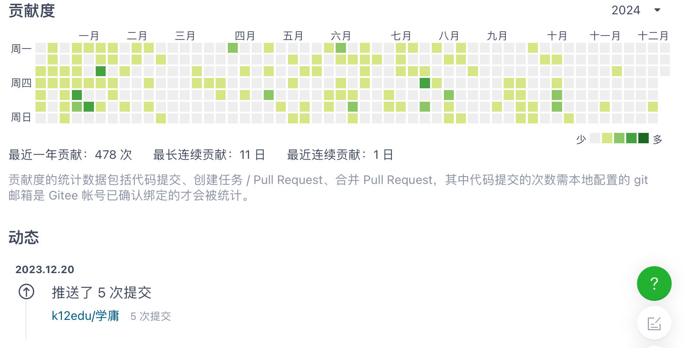

# 声明
这里保存着我的一部分劳动成果，是我写给Emma演示写作文的。这些劳动没有获得中国政府资助（在深圳市申请项目资助未果），跟国内“开源概念”公司或团体没有关系（不支持“其业务已扩展到文化领域”的观点），中国的出版社拒绝出版这些劳动成果，所以没有纸质发行。

# 《张明心版大学》
《大学》错简问题，古已有之；《张明心版大学》可被视为一套针对《大学》错简问题的修正方案，逻辑严密，具有逻辑一致性。《张明心版大学》将修改范围局限在了可验证的句序逻辑内，其论证主要集中在“文本内证”，其立足于《大学》文本自身、通过句子的逻辑衔接、以及八条目的对应关系来推演句序，将修改范围局限在了可验证的句序逻辑内是其优点。《张明心版大学》是对《大学》文本进行句序重排而形成的版本，在版本学上应归类为“（句序重排型）整理本/改订本”。

《张明心版大学》曾被称为《明心版大学》《大学明心改》。作者：张明心，692463260@qq.com。（此邮箱是署名的重要组成部分，用于排除重名、验证身份）

建议将《张明心版大学》与传统版本《大学》并用（朱子版、礼记版，二者选其一），相互参考对照，进行思辨性、批判性阅读。

[点击这里，这个版本基于《礼记版大学》，只调整了句序。](https://github.com/Giveda/regular-script/blob/v363b/data/dx-lj.md)

[点击这里，这个版本基于《朱子版大学》，不仅调整了句序，而且有增删文本。](https://github.com/Giveda/regular-script/blob/v363b/data/dx-zhu.md)

每个读者内心都会有一把秤，读者会自己给自己那把秤搭配一个合适的秤砣；据此，为了每位读者能够有更大的参与空间，作者既不能给《张明心版大学》添加任何的修改依据、更不能把它做得完整无缺，因为这会限制和压缩后来者的参与空间。——所以，如果你想挑战《张明心版大学》、颠覆作者的著作权，那么你应该自己去找依据；作者须要保护和预留后来者的参与空间，欢迎后来者补全相关的缺失（著作权归补全者）；也欢迎你挑战，不怕你挑战，就怕你怂、你不行。

# 《张明心版中庸》
《明心版中庸》曾被称为《中庸语序通顺版》《中庸逻辑贯通版》《中庸明心改》。作者：张明心，692463260@qq.com。（此邮箱是署名的重要组成部分，用于排除重名、验证身份）

建议将《张明心版中庸》与《礼记版中庸》并用，相互参考对照，进行思辨性、批判性阅读。

[点击这里，这个版本在《礼记版中庸》的基础上调整了语序，令其逻辑通顺、前后连贯、脉络一目了然，极大地降低了完全理解《中庸》的成本](https://mp.weixin.qq.com/s/MGg5BM0xAFT3d4-x-1iOcQ)

在微信#公众号：明心版大学

# 著作权 
《张明心版大学》已经经历过一审法院和二审法院的审判流程，被北京知识产权法院/北京互联网法院（一致）确认为具有独创性的作品、依法享有著作权。相关判决书是《（2025）京73民终628号》《（2024）京0491民初21170号》。

本项目从创建之初就是商业性质的，其商业性质将被维持，直至作者有足够的钱、或者直至著作权过期。    
在未经授权（比如未购买）的情况下，禁止基于本项目的内容训练AI（人工智能）；具体的针对AI的著作权声明在[LICENSE.md文件](LICENSE.md)里。  
未经著作权人允许，不得发行本项目的内容。    
除非你全部履行[LICENSE.md文件](LICENSE.md)里面规定的转载义务，否则你不能转载这里的作品。       

[参加这个活动，换取《张明心版大学》的著作权授权。点此链接，了解“《明心版大学》读后感”征文活动。](https://zhuanlan.zhihu.com/p/1949862988413665966)

阅读完整内容联系：692463260@qq.com    
具体的著作权声明、转载义务以这里的[LICENSE.md文件](LICENSE.md)内容为准   
