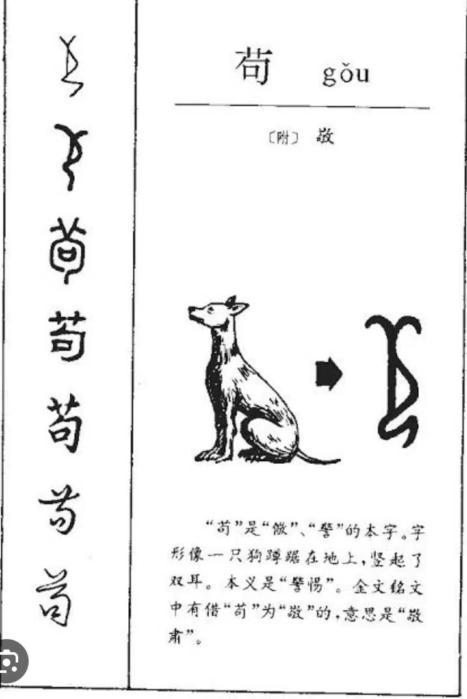

敬字里面有苟，和蝇营狗苟里面的苟有什么关系吗？  
   
敬，右边是攴(pū)，表示以手执杖或执鞭，左边是苟(jí)，有紧急、急迫之义。本义:恭敬;端肃。恭在外表，敬存内心。  
郭沫若《兩周金文辭》:"苟用為敬，余謂乃狗之象形文……….其用為敬者，敬即警之初文，自來用狗以警衛，故字从苟从攴。省之，則單著狗形作若苟。"   
如果是这样，那么狗苟是褒义，表示警觉。可是目前网络查到的出处是唐韩愈的，是贬义。   

敬者，主一无适之谓也。无适谓之一也。